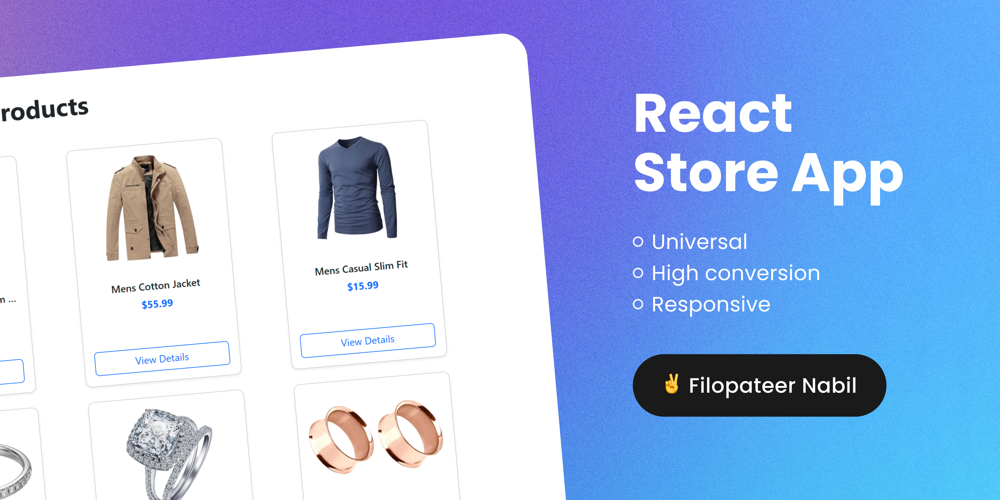

# React-Store-APP

> **Description:**  
This is a hands-on project: a **React Product App** that fetches data from an external API and displays it beautifully using **Bootstrap**.  

In this project, I did the following:  
- Used **React Context API** for global state management.  
- Fetched product data from an API using **Axios**.  
- Implemented **Routing** between pages with **React Router**.  
- Added **SweetAlert2 alerts** for user actions.  
- Improved **SEO** for each page using **React Helmet**.  
- Added **offline detection** to notify users when they lose internet connection.  
- Added **loading spinners** while data is being fetched.  

> Check the screenshots below to see how the app looks in action.

## 📸 Screenshots
  

## 🔧 Run the Project
```bash
npm run dev
